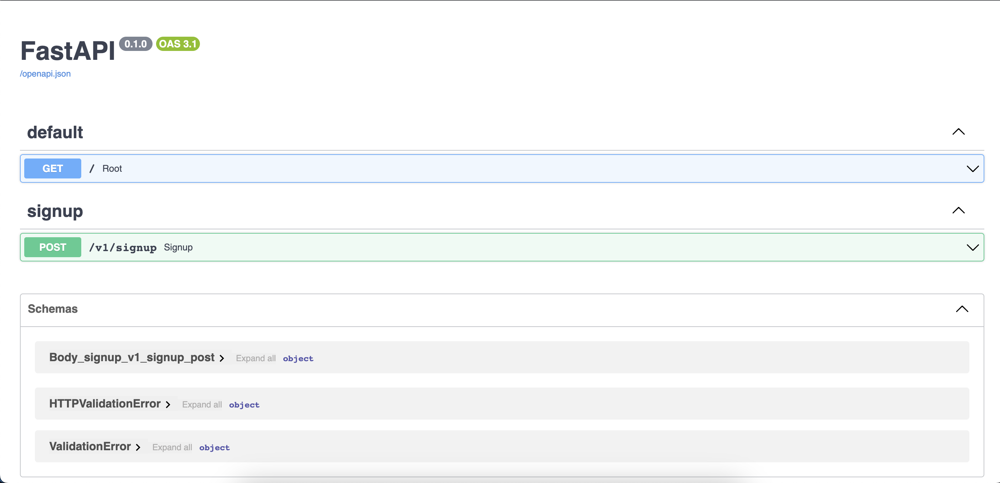

# Project Setup Guide

This is backend application for a analytics platform where users can ask natural language queries over their database & get corresponding SQL queries.

## Requirements

- Python 3.11.4
- pip 23.2.1
- PostgreSQL 15
- FastAPI
- psycopg2
- pgvector extension for PostgreSQL - [pgvector](https://github.com/pgvector/pgvector)


## Installation

1. **Python and pip**

    You can download Python from the official website: [https://www.python.org/downloads/](https://www.python.org/downloads/)
    or install using brew:

    ```bash
    brew install python
    ```

    After installing Python, verify the installation with the following command:

    ```bash
    python3 --version
    ```

    pip is included in the Python installation by default. You can verify its installation with the following command:
    ```bash
    pip3 --version
    ```

    If you want to upgrade pip version:
    ```bash
    pip install --upgrade pip
    ```

2. **Virtual Environment**

    It is recommended to create a virtual environment to isolate your project and avoid conflicts with other packages. You can create a virtual environment using the following commands:
    ```bash
    python3 -m venv env
    source env/bin/activate
    ```

3. **PostgreSQL**

    Install PostgreSQL by following the instructions on the official website: [https://www.postgresql.org/download/](https://www.postgresql.org/download/)

    If you are running postgres MacOS app, then you won't be able to install the required pgvector extension. You can install postgres using brew:
    ```bash
    brew install postgresql@15
    ```

    After Postgres installion, install the pgvector extension:
    ```bash
    cd /tmp
    git clone --branch v0.4.4 https://github.com/pgvector/pgvector.git
    cd pgvector
    make
    export PG_CONFIG=/opt/homebrew/opt/postgresql@15/bin/pg_config
    sudo --preserve-env=PG_CONFIG make install
    ```

    After installation, verify it with the following command:
    ```bash
    psql --version
    ```

4. **Psycopg2**

    Psycopg2 is a PostgreSQL adapter for Python. Install it with the following command:

    ```bash
    pip3 install psycopg2
    ```

    If you face any issues while installing psycopg2, try the following command:

    ```bash
    env LDFLAGS="-I/opt/homebrew/Cellar/openssl@3/3.1.1/include -L/opt/homebrew/Cellar/openssl@3/3.1.1/lib"
    pip3 install psycopg2
    ```
    Please note that this assumes you have installed openssl@3 using brew. If your openssl version is different, please change the path accordingly.


## Database Setup

1. **Creating the PostgreSQL Role**

    Create a PostgreSQL role with superuser permissions and login capability:
    ```sql
    create role shuru with superuser;
    alter role shuru with login;
    ```

2. **Creating the Databases**

    Create two databases, `analytics` and `analytics_test`, with the `shuru` role:
    ```bash
    createdb -U shuru -h localhost -p 5432 -W analytics
    createdb -U shuru -h localhost -p 5432 -W analytics_test
    ```

3. **Creating the Table and Extension**

    Run these commands in your PostgreSQL command line client to create the `embeddings` table and `vector` extension:
    ```sql
    CREATE EXTENSION vector;
    ```


## Running the Project

1. **Project Requirements**

    Install the project requirements using the `requirements.txt` file:
    ```bash
    pip3 install -r requirements.txt
    ```

2. **Database Migrations**

    Run the database migrations using the
    `alembic.ini` file:
    ```bash
    alembic upgrade head
    ```

3. **Running the Server**

	  Run the server using the following
    command:
    ```bash
    uvicorn app.main:app --reload
    ```

4. **Running the Tests**

	  Run the tests using the following
    command:
    ```bash
    pytest
    ```

    To generate the coverage report, run the following command:
    ```bash
    pytest --cov=. app/tests/ --cov-report html
    ```

    This will generate the reports in a folder named `coverage_report` in the root directory of the project.

    To view the coverage report, open the `index.html` file in the `coverage_report` folder in your browser.
    ```bash
    open coverage_report/index.html
    ```

5. **Browser**

    In your browser open *http://localhost:8000/docs* & you can tryout available APIs.

    

    ```bash
    http://localhost:8000/docs
    ```


## Project File Structure
```
app
├── alembic/
├── app
│   ├── api/v1 #includes all routes for app
│   ├── crud #includes data access layer operations
│   └── db #includes setup for database
│   └── models #includes all sqlalchemy models for db tables
│   └── schemas #includes pydantics schemas for request/response
│   └── tests #houses all tests
│   └── main.py
├── requirements.txt
├── .env
├── .gitignore
└── alembic.ini
└── README.md
```
